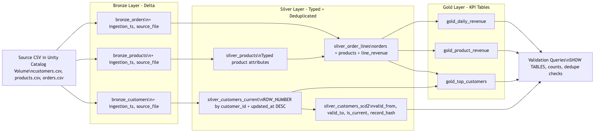
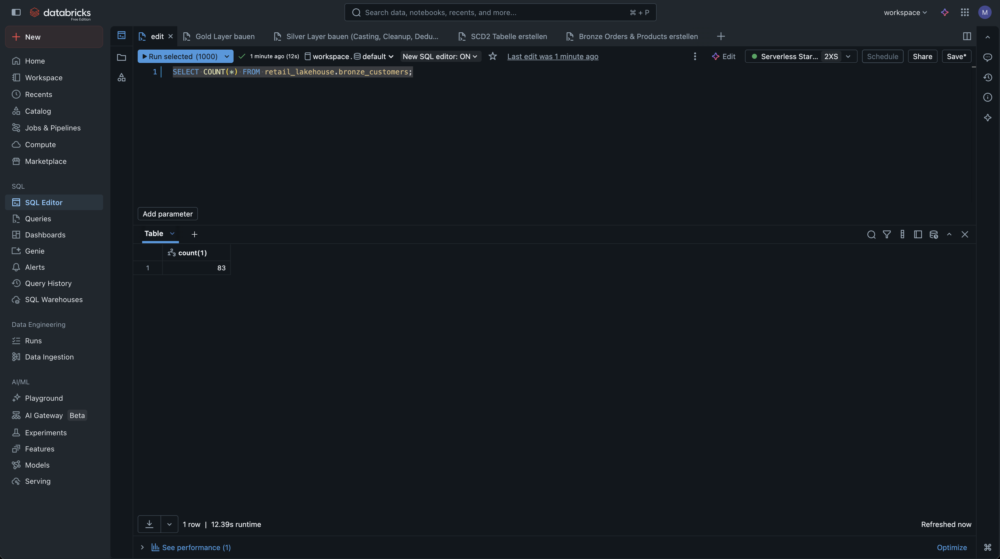
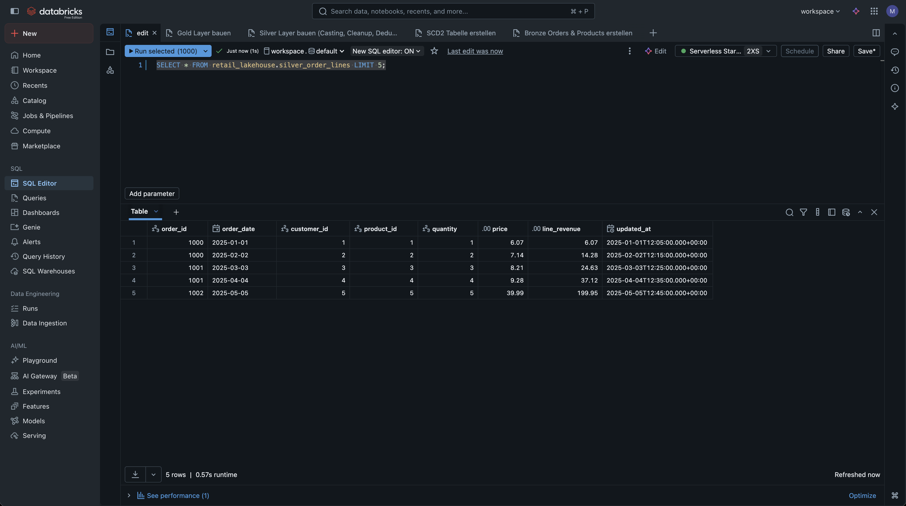
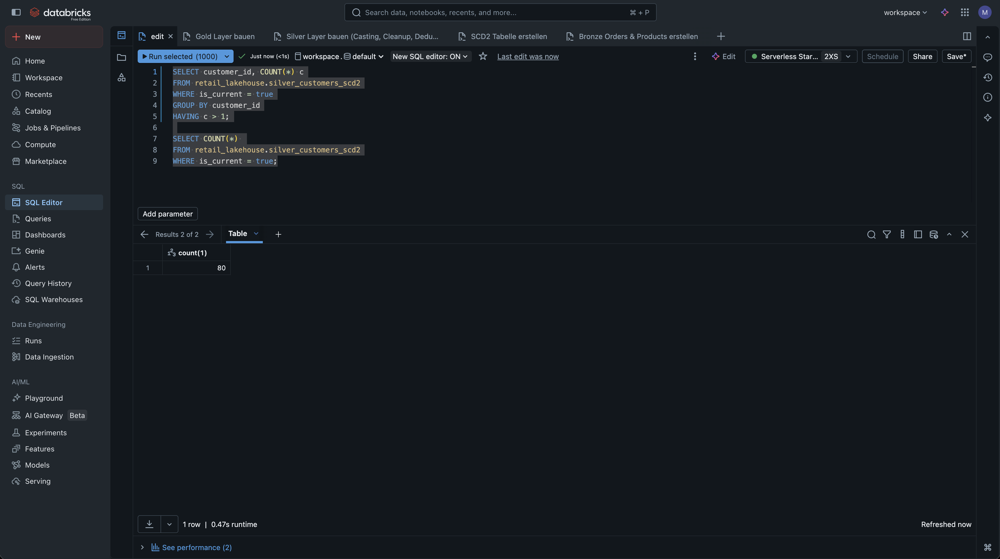
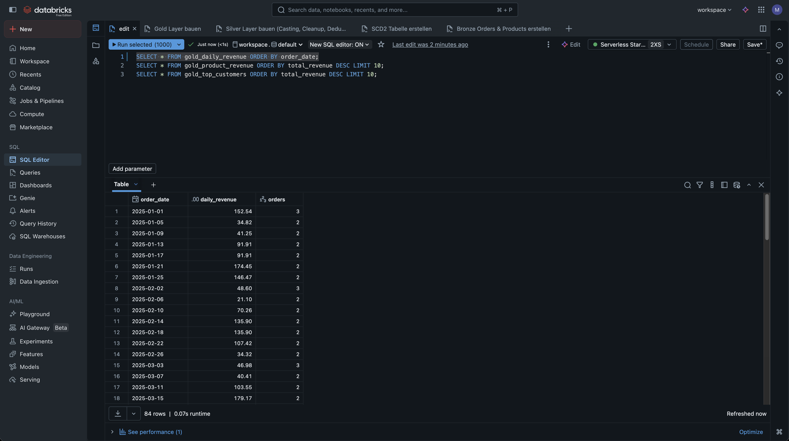
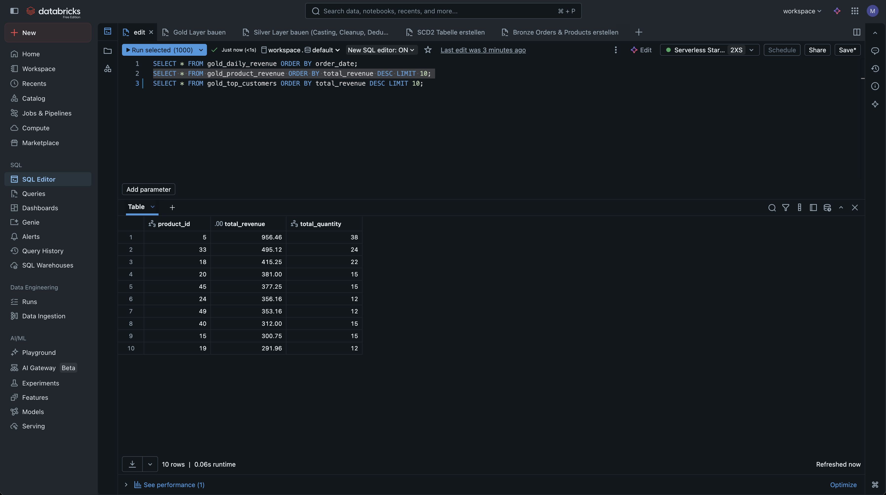
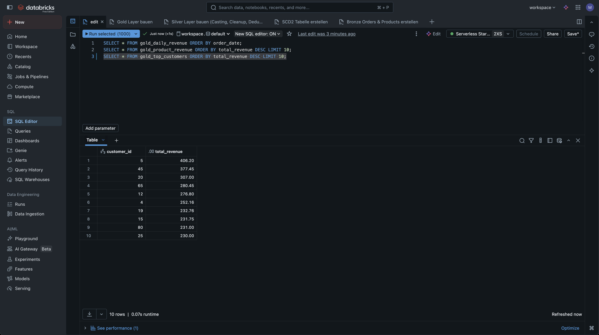
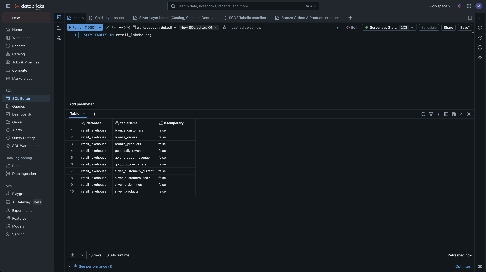
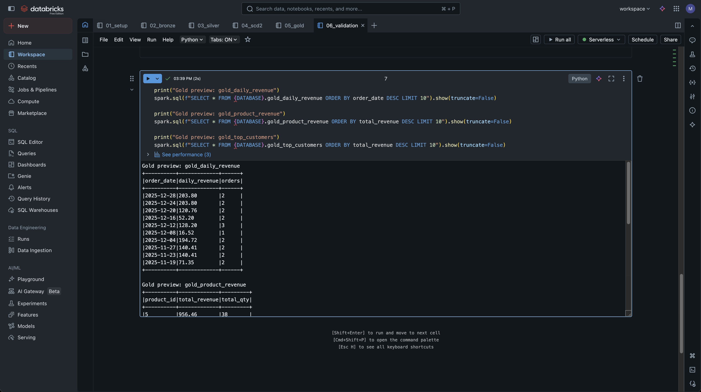

# databricks-retail-lakehouse

[](https://github.com/Marlediv/databricks-retail-lakehouse/actions/workflows/ci.yml)
[](https://github.com/Marlediv/databricks-retail-lakehouse/actions/workflows/format.yml)
[](https://www.python.org/)
[](https://github.com/astral-sh/ruff)
[](https://github.com/psf/black)

Retail Lakehouse Mini-Projekt auf Databricks mit einem klaren Medallion-Aufbau (Bronze, Silver, Gold) und Delta-Tabellen. Die Pipeline verarbeitet CSV-Daten aus Unity Catalog Volumes, bereitet sie schrittweise auf und liefert KPI-Tabellen für Reporting. Zusätzlich wird eine SCD2-Kundendimension aufgebaut und mit einfachen Qualitätsprüfungen validiert.

## Warum dieses Projekt?

- Zeigt, wie operative Retail-Daten in eine stabile Analysebasis überführt werden.
- Trennt Rohdatenverarbeitung und KPI-Berechnung, damit Änderungen kontrollierbar bleiben.
- Liefert nachvollziehbare Kennzahlen als Grundlage für Produkt-, Umsatz- und Kundenanalysen.

## Was demonstriert es technisch?

- Datenzugriff über Unity Catalog Volume Paths.
- Delta-Tabellen als Speicherformat (`USING DELTA`).
- Medallion-Architektur (Bronze/Silver/Gold).
- Deduplizierung mit `ROW_NUMBER()` auf Basis von `updated_at`.
- SCD Type 2 für Kunden mit Hash-basierter Änderungslogik.
- Idempotente Ausführung durch `CREATE OR REPLACE` / kontrollierte Reloads.
- Data Quality Checks über dedizierte Validierungsqueries.
- KPI-Layer für tägliche Umsätze, Produktumsatz und Top-Kunden.

## Projektstruktur

```text
databricks-retail-lakehouse/
  data/
    customers.csv
    products.csv
    orders.csv
  notebooks/
    01_setup.py
    02_bronze.py
    03_silver.py
    04_scd2.py
    05_gold.py
    06_validation.py
  sql/
    01_setup.sql
    02_bronze.sql
    03_silver.sql
    04_scd2.sql
    05_gold.sql
    06_validation.sql
  docs/
    architecture.mmd
    architecture.png
    data_dictionary.md
    screenshots/
      .gitkeep
      README.md
  README.md
```

## Architektur



Editierbare Quelle: `docs/architecture.mmd`

## Databricks SQL Runbook

### Setup

1. SQL Warehouse starten.
2. CSV-Dateien ins Volume legen:
- `/Volumes/workspace/retail_lakehouse/retail_lakehouse_files/customers.csv`
- `/Volumes/workspace/retail_lakehouse/retail_lakehouse_files/products.csv`
- `/Volumes/workspace/retail_lakehouse/retail_lakehouse_files/orders.csv`

### Run order

1. Setup: `sql/01_setup.sql`
2. Daten laden (Bronze): `sql/02_bronze.sql`
3. Silver-Transformation: `sql/03_silver.sql`
4. SCD2 aufbauen: `sql/04_scd2.sql`
5. Gold-KPIs berechnen: `sql/05_gold.sql`
6. Validierung ausführen: `sql/06_validation.sql`

## Expected Outputs

Bronze:
- `retail_lakehouse.bronze_customers`
- `retail_lakehouse.bronze_products`
- `retail_lakehouse.bronze_orders`

Silver:
- `retail_lakehouse.silver_customers_current`
- `retail_lakehouse.silver_products`
- `retail_lakehouse.silver_order_lines`
- `retail_lakehouse.silver_customers_scd2`

Gold:
- `retail_lakehouse.gold_daily_revenue`
- `retail_lakehouse.gold_product_revenue`
- `retail_lakehouse.gold_top_customers`

## Validierung

Wichtige Prüfungen aus `sql/06_validation.sql`:
- `SHOW TABLES IN retail_lakehouse;`
- Row counts für `bronze_customers`, `silver_customers_current`, `silver_customers_scd2` (nur `is_current = true`) und `gold_daily_revenue`
- Dedupe-Checks auf `customer_id` in `silver_customers_current`
- Dedupe-Checks auf aktuelle Datensätze (`is_current = true`) in `silver_customers_scd2`

## Screenshots (Evidence)

Belege aus dem Databricks SQL Editor für die wichtigsten Pipeline-Schritte.

### Bronze



### Silver




### Gold





### Übersicht




## Troubleshooting

- Falscher DB-Kontext: sicherstellen, dass `USE retail_lakehouse;` aktiv ist.
- Fehlerhafte Volume-Pfade: Pfade exakt wie oben verwenden und Dateinamen prüfen.
- Warehouse nicht aktiv: SQL-Queries laufen nur mit gestartetem SQL Warehouse.
- Leere Gold-Ergebnisse: zuerst prüfen, ob Bronze- und Silver-Tabellen erfolgreich aufgebaut wurden.

## Quality & CI

- **Ruff / Black / Pytest:** Der CI-Workflow `.github/workflows/ci.yml` lintet den Code mit `ruff check .`, prüft Formatierung mit `black --check .` und führt `pytest -q` aus.
- **Notebook-Validation:** Zusätzlich validiert CI alle `.ipynb` via `nbformat` (JSON parsebar, keine Outputs committed, `execution_count` leer) und kompiliert alle getrackten Python-Dateien.
- **Manueller Format-Workflow:** Wenn `black` lokal nicht ausführbar ist (z. B. DNS/PEP668), kann `.github/workflows/format.yml` manuell (`workflow_dispatch`) gestartet werden. Der Workflow führt `black .` aus, committed nur bei Änderungen und stößt danach CI erneut an.
- **Repository checks:** `tests/test_repo_integrity.py` stellt sicher, dass Kernpfade (`docs`, `notebooks`, `sql`) und Notebook-Artefakte vorhanden sind und keine offensichtlichen Platzhaltermarkierungen in kritischen Textdateien enthalten sind.
- **Lokale Befehle:**

```bash
python -m pip install --upgrade pip
python -m pip install pytest ruff black nbformat
ruff check .
black --check .
pytest -q
python -m py_compile $(git ls-files '*.py')
python - <<'PY'
import nbformat
from pathlib import Path

for path in Path('.').rglob('*.ipynb'):
    nb = nbformat.read(path, as_version=4)
    for cell in nb.cells:
        outputs = cell.get('outputs') or []
        assert not outputs, f'Outputs detected in {path}'
        assert cell.get('execution_count') is None, f'Execution count still set in {path}'
PY
```

Alle Befehle laufen lokal ohne Databricks-Workspace oder Secrets.

Wenn `black` lokal nicht installierbar ist (z. B. DNS/PEP668), kann der manuelle Workflow `.github/workflows/format.yml` ueber GitHub Actions (`format`, Trigger: `workflow_dispatch`) gestartet werden; er fuehrt `black .` aus und pusht nur bei echten Format-Aenderungen nach `main`.

## Notebooks (optional)

Das SQL-Runbook unter `sql/` ist die primäre Referenz (Source of Truth).  
Die Notebooks unter `notebooks/` sind eine alternative PySpark-Ausführung derselben Pipeline (Bronze -> Silver -> SCD2 -> Gold).

Reihenfolge:
1. `notebooks/01_setup.py`
2. `notebooks/02_bronze.py`
3. `notebooks/03_silver.py`
4. `notebooks/04_scd2.py`
5. `notebooks/05_gold.py`
6. `notebooks/06_validation.py`
